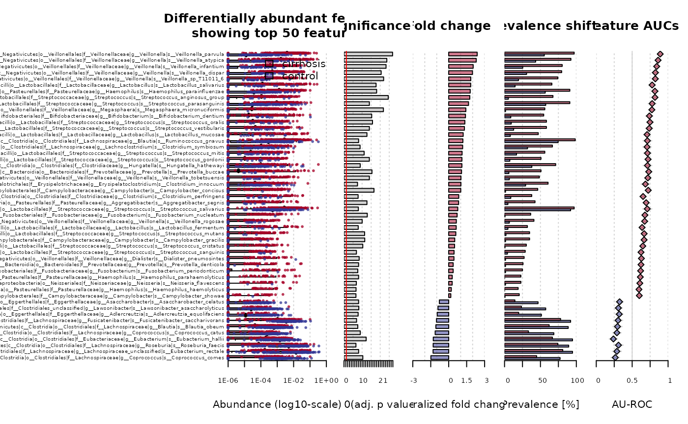

# Exploration of the liver cirrhosis dataset

Packages used here:

``` r

library(curatedMetagenomicData)
library(curatedMetagenomicAnalyses)
library(dplyr)
```

## Cirrhosis exploratory analysis

``` r

se <-
    curatedMetagenomicAnalyses::makeSEforCondition("cirrhosis", removestudies = "HMP_2019_ibdmdb", dataType = "relative_abundance")
```

    ## 
    ## $`2021-10-14.LoombaR_2017.relative_abundance`
    ## dropping rows without rowTree matches:
    ##   k__Bacteria|p__Actinobacteria|c__Coriobacteriia|o__Coriobacteriales|f__Coriobacteriaceae|g__Collinsella|s__Collinsella_stercoris
    ##   k__Bacteria|p__Firmicutes|c__Bacilli|o__Bacillales|f__Bacillales_unclassified|g__Gemella|s__Gemella_bergeri
    ##   k__Bacteria|p__Firmicutes|c__Bacilli|o__Lactobacillales|f__Carnobacteriaceae|g__Granulicatella|s__Granulicatella_elegans
    ##   k__Bacteria|p__Firmicutes|c__Erysipelotrichia|o__Erysipelotrichales|f__Erysipelotrichaceae|g__Bulleidia|s__Bulleidia_extructa
    ##   k__Bacteria|p__Proteobacteria|c__Betaproteobacteria|o__Burkholderiales|f__Sutterellaceae|g__Sutterella|s__Sutterella_parvirubra
    ##   k__Bacteria|p__Synergistetes|c__Synergistia|o__Synergistales|f__Synergistaceae|g__Cloacibacillus|s__Cloacibacillus_evryensis

    ## $`2021-03-31.QinN_2014.relative_abundance`
    ## dropping rows without rowTree matches:
    ##   k__Bacteria|p__Actinobacteria|c__Coriobacteriia|o__Coriobacteriales|f__Atopobiaceae|g__Olsenella|s__Olsenella_profusa
    ##   k__Bacteria|p__Actinobacteria|c__Coriobacteriia|o__Coriobacteriales|f__Coriobacteriaceae|g__Collinsella|s__Collinsella_stercoris
    ##   k__Bacteria|p__Actinobacteria|c__Coriobacteriia|o__Coriobacteriales|f__Coriobacteriaceae|g__Enorma|s__[Collinsella]_massiliensis
    ##   k__Bacteria|p__Firmicutes|c__Bacilli|o__Bacillales|f__Bacillales_unclassified|g__Gemella|s__Gemella_bergeri
    ##   k__Bacteria|p__Firmicutes|c__Bacilli|o__Lactobacillales|f__Carnobacteriaceae|g__Granulicatella|s__Granulicatella_elegans
    ##   k__Bacteria|p__Firmicutes|c__Clostridia|o__Clostridiales|f__Ruminococcaceae|g__Ruminococcus|s__Ruminococcus_champanellensis
    ##   k__Bacteria|p__Firmicutes|c__Erysipelotrichia|o__Erysipelotrichales|f__Erysipelotrichaceae|g__Bulleidia|s__Bulleidia_extructa
    ##   k__Bacteria|p__Proteobacteria|c__Betaproteobacteria|o__Burkholderiales|f__Sutterellaceae|g__Sutterella|s__Sutterella_parvirubra
    ##   k__Bacteria|p__Synergistetes|c__Synergistia|o__Synergistales|f__Synergistaceae|g__Cloacibacillus|s__Cloacibacillus_evryensis

``` r

library(table1)
```

    ## Registered S3 method overwritten by 'table1':
    ##   method    from
    ##   [.indexed plyr

    ## 
    ## Attaching package: 'table1'

    ## The following objects are masked from 'package:base':
    ## 
    ##     units, units<-

``` r

df = data.frame(colData(se)[, 1:10])
table1::label(df$study_name) <- "Study Name"
table1::label(df$body_site) <- "Body site"
table1::label(df$study_condition) <- "Study condition"
table1::label(df$antibiotics_current_use) <- "Current Antibiotics Use"
units(df$age) <- "Years"
```

``` r

table1(~ . -  subject_id | study_name, data = df)
```

[TABLE]

There seems to be strong correlation between study condition and current
antibiotics use, raising questions of causality direction in these
predictions:

``` r

table(df$study_condition, df$antibiotics_current_use)
```

    ##            
    ##              no
    ##   cirrhosis 123
    ##   control   114

## Compositionality

Many, but not all, columns add up to 100%:

``` r

summary(colSums(assay(se)))
```

    ##    Min. 1st Qu.  Median    Mean 3rd Qu.    Max. 
    ##   97.04   99.98  100.00   99.92  100.00  100.00

The observation with minimum sum of relative abundances is:

``` r

colData(se)[which.min(colSums(assay(se))), ]
```

    ## DataFrame with 1 row and 31 columns
    ##       study_name  subject_id   body_site antibiotics_current_use
    ##      <character> <character> <character>             <character>
    ## LV-1   QinN_2014        LV-1       stool                      no
    ##      study_condition             disease       age age_category      gender
    ##          <character>         <character> <integer>  <character> <character>
    ## LV-1       cirrhosis cirrhosis;hepatitis        42        adult        male
    ##          country non_westernized sequencing_platform DNA_extraction_kit
    ##      <character>     <character>         <character>        <character>
    ## LV-1         CHN              no       IlluminaHiSeq                 NA
    ##             PMID number_reads number_bases minimum_read_length
    ##      <character>    <integer>    <numeric>           <integer>
    ## LV-1    25079328     34522116   3452211600                 100
    ##      median_read_length      NCBI_accession      curator       BMI
    ##               <integer>         <character>  <character> <numeric>
    ## LV-1                100 ERR528291;ERR528292 Paolo_Manghi     19.03
    ##      disease_subtype antibiotics_family  creatine  albumine     alcohol
    ##          <character>        <character> <numeric> <numeric> <character>
    ## LV-1   HBV;cirrhosis                 NA        65      31.2         yes
    ##      disease_stage bilirubin prothrombin_time       inr       ctp
    ##        <character> <numeric>        <numeric> <numeric> <integer>
    ## LV-1            NA      1.82               NA      1.18         6

Note, this a result of species where phylogenetic information was
unavailable in building of the `TreeSummarizedExperiment`. It would be
possible to take data directly from `ExperimentHub` to avoid the data
loss, but the data loss is rare and small and probably unimportant for
most purposes.

## SIAMCAT analysis

From the [SIAMCAT
vignette](https://www.bioconductor.org/packages/release/bioc/vignettes/SIAMCAT/inst/doc/SIAMCAT_vignette.html).

``` r

if(!requireNamespace("SIAMCAT"))
  BiocManager::install("SIAMCAT")
library(SIAMCAT)
```

``` r

labs <-
  create.label(meta = data.frame(colData(se)),
               label = 'study_condition',
               case = 'cirrhosis')
```

    ## Label used as case:
    ##    cirrhosis
    ## Label used as control:
    ##    control

    ## + finished create.label.from.metadata in 0.022 s

``` r

sc.obj <- siamcat(feat=assay(se)/100,
    label=labs,
    meta=data.frame(colData(se)))
```

    ## + starting validate.data

    ## +++ checking overlap between labels and features

    ## + Keeping labels of 282 sample(s).

    ## +++ checking sample number per class

    ## +++ checking overlap between samples and metadata

    ## + finished validate.data in 0.066 s

``` r

show(sc.obj)
```

    ## siamcat-class object
    ## label()                Label object:         150 control and 132 cirrhosis samples
    ## 
    ## contains phyloseq-class experiment-level object @phyloseq:
    ## phyloseq@otu_table()   OTU Table:            [ 697 taxa and 282 samples ]
    ## phyloseq@sam_data()    Sample Data:          [ 282 samples by 31 sample variables ]

Unsupervised filtering:

``` r

sc.obj <- filter.features(sc.obj,
    filter.method = 'abundance',
    cutoff = 0.001)
```

    ## Features successfully filtered

### Association testing

``` r

sc.obj <- check.associations(
    sc.obj,
    alpha = 0.05,
    mult.corr = "fdr"
)

sc.obj <- association.plot(sc.obj,
    sort.by = 'fc',
    plot.type = "quantile.box",
    panels = c("fc", "prevalence", "auroc")
)
```

    ## ### ATTENTION: Not plotting to a pdf-file.
    ## ### The plot is optimized for landscape DIN-A4 (or similar) layout.
    ## ### Please make sure that your plotting region is large enough!!!
    ## ### Use at your own risk...

    ## Are you sure that you want to continue? (Yes/no/cancel)


